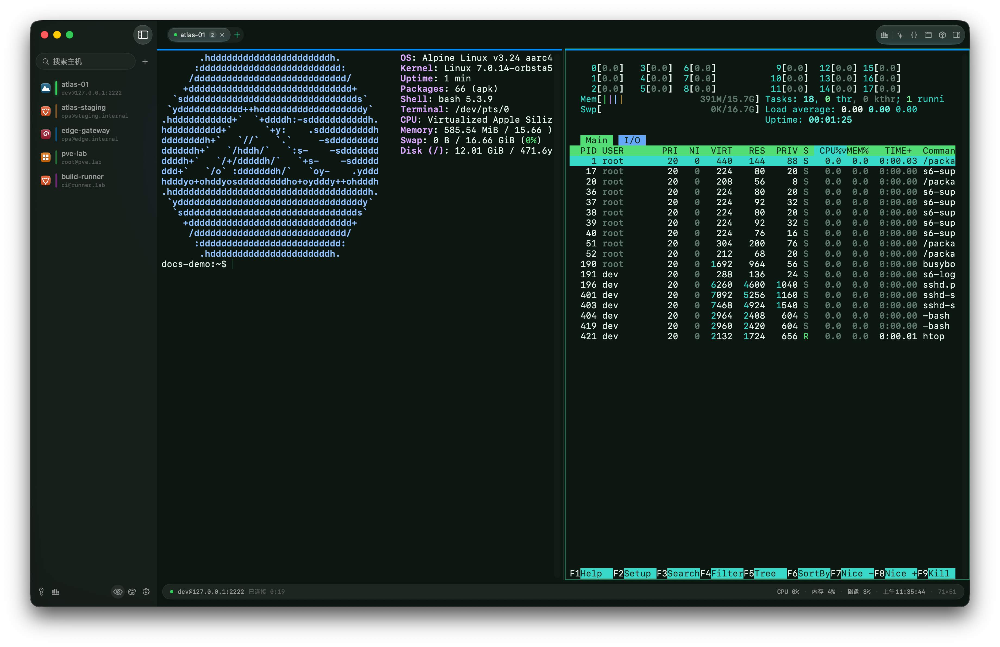
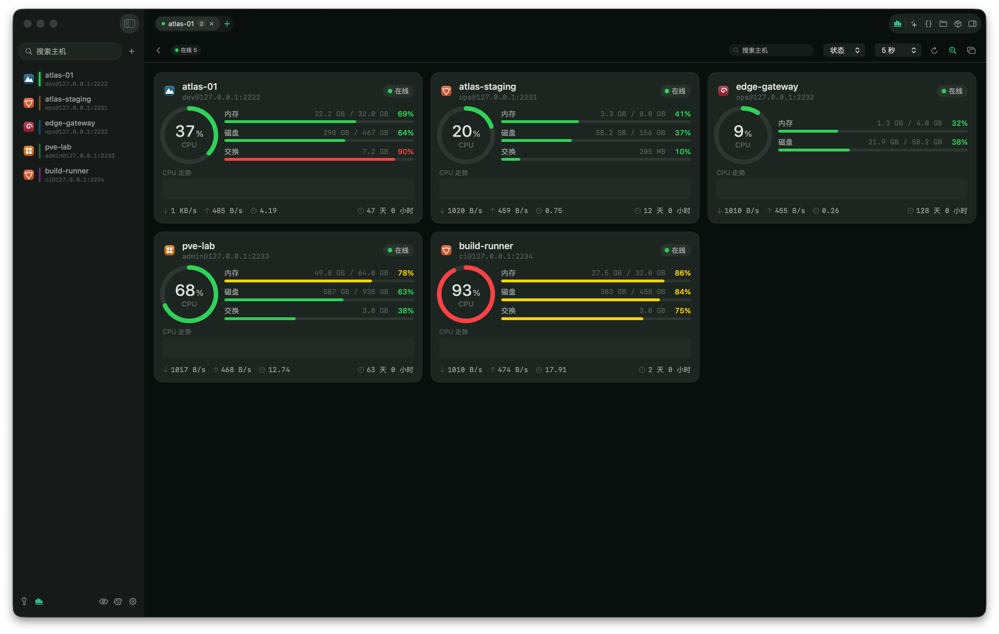

  

<h1 align="center">Berth</h1>

  面向 macOS 的原生 SSH 工作台：终端、SFTP、端口转发与 AI 协作，集中在一处。

  <a href="https://github.com/xinghelee/Berth/releases/latest">下载最新版</a> ·
  <a href="https://github.com/xinghelee/Berth/releases">发行记录</a> ·
  <a href="README.md">English</a>

  macOS 15+(建议 macOS 26)· Universal · Developer ID 签名 · Apple 公证

## 为远程工作而设计

Berth 是一款 Swift 原生 macOS SSH 客户端，适合需要频繁切换主机、维护服务和处理远程文件的开发者与运维人员。它保留终端的直接性，同时把连接、文件与上下文工具组织成更顺手的工作区。

| 能力 | 说明 |
| --- | --- |
| 终端工作区 | 标签页、可嵌套分屏、搜索、主题、断线自动重连与会话复用。 |
| 连接管理 | 密码、私钥、ssh-agent 与 keyboard-interactive 认证；支持 ssh_config 导入、跳板机、HTTP/SOCKS5 代理。 |
| 网络工具 | 本地、远程与动态 SOCKS5 端口转发，方便临时调试和内网访问。 |
| SFTP 文件面板 | 复用当前 SSH 会话浏览、上传、下载、预览和编辑远程文件；支持拖放文件与递归下载文件夹。 |
| 服务器视图 | 仪表盘展示 CPU、内存、磁盘、网络、负载等指标；Docker/Podman 面板可查看容器状态与日志。 |
| AI 助手 | 在当前终端上下文中分析问题、提出或执行命令；支持 Markdown（包括表格）和可配置的命令确认。 |

## 键盘优先

常用操作无需离开终端：⌘K 快速连接、⌘T 新标签、⌘D 分屏、⌘F 搜索、⌘I 服务器信息、⌘⇧A AI 助手。Ctrl 组合键始终交给远端 shell，保留你的 readline、vim 与 Emacs 使用习惯。

## AI 助手与提供商

AI 面板可结合当前会话运行命令、读取输出并继续分析。内置 Anthropic、OpenAI、Fireworks AI、Gemini、DeepSeek、OpenRouter、Ollama、LM Studio 等预设，也可填写任意兼容 OpenAI 或 Anthropic 格式的服务地址与模型。

API Key 仅保存在 macOS Keychain。启用云端模型时，只有完成当前请求所需的内容会发送给你配置的 AI 服务商；请按所在团队的安全政策选择模型与上下文范围。

## 安全与隐私

- 密码、私钥与 passphrase 只存入 macOS Keychain，不以明文写入项目数据库或 JSON 备份。
- known_hosts 校验会在首次连接和主机指纹变更时明确提示。
- Berth 不要求账户，也不依赖自有云端来建立 SSH 连接。
- 本页截图全部来自内存数据与本地测试容器；主机名、地址和账号均为演示内容，真实地址已打码。

## 安装

通过 Homebrew：

~~~sh
brew install --cask xinghelee/tap/berth
~~~

或前往 [GitHub Releases](https://github.com/xinghelee/Berth/releases/latest) 下载 Berth-&lt;version&gt;.dmg，再将 Berth.app 拖入「应用程序」。发行版经过 Developer ID 签名并完成 Apple 公证。

## 从源码构建

要求：macOS 15+、Xcode 16+（含 Metal 工具链）和 [XcodeGen](https://github.com/yonaskolb/XcodeGen)。

~~~sh
xcodegen generate
xcodebuild -project Berth.xcodeproj -scheme Berth -configuration Debug build
xcodebuild -project Berth.xcodeproj -scheme Berth test
~~~

Berth.xcodeproj 由 XcodeGen 生成，不提交到仓库。若 Xcode 缺少 Metal 工具链，可执行：

~~~sh
xcodebuild -downloadComponent metalToolchain
~~~

## 技术栈

- Swift + SwiftUI，终端视图通过 AppKit 桥接
- [SwiftTerm](https://github.com/migueldeicaza/SwiftTerm) 终端模拟与 Metal 渲染
- [Citadel](https://github.com/orlandos-nl/Citadel) 与 vendored swift-nio-ssh 负责 SSH；RSA 认证补丁详见 [vendor/PATCHES.md](vendor/PATCHES.md)
- SwiftData、XcodeGen、Developer ID 签名与公证 DMG 分发

## 许可证

Berth 采用 [GPL-3.0](LICENSE) 许可证。第三方依赖保留各自许可证，详见 vendor/。
